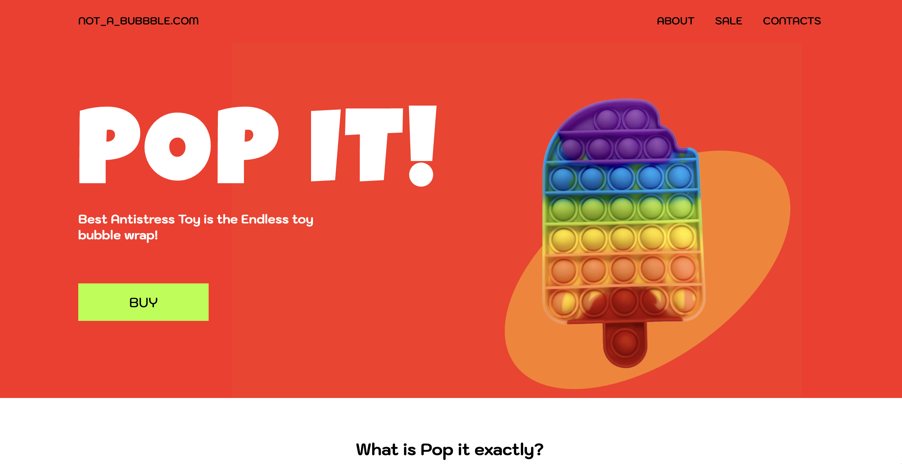
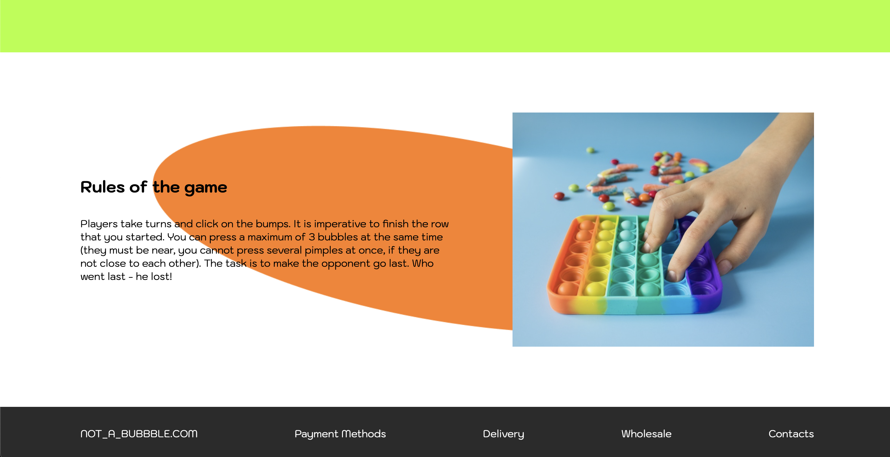
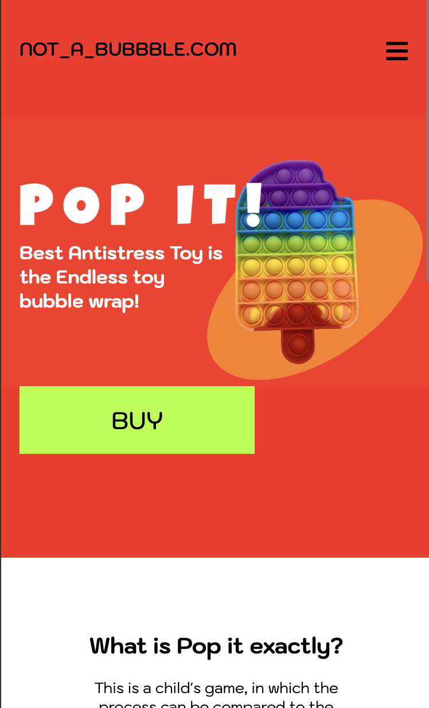
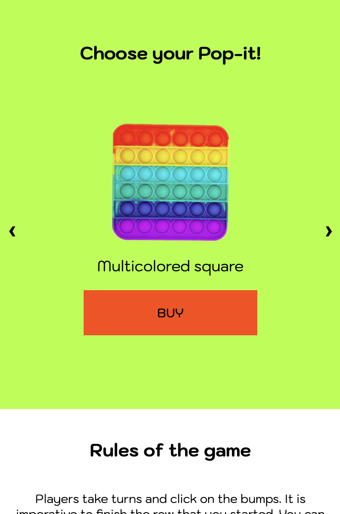
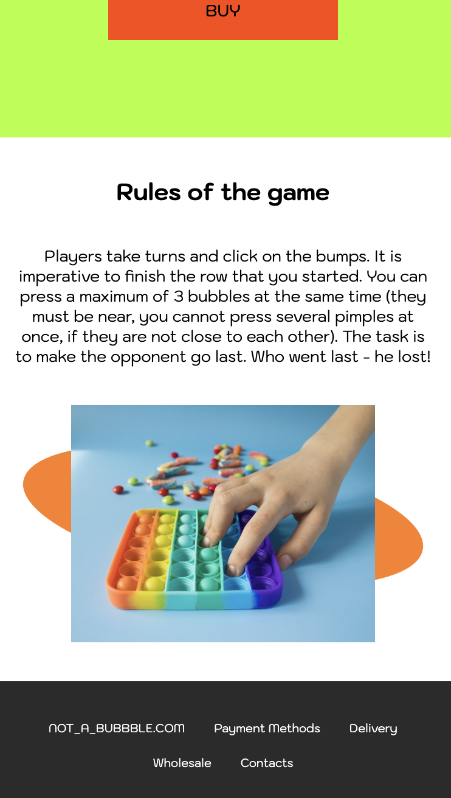

# Pop It! — Responsive Web Toy Shop

This is a responsive landing page for a fictional toy store called **NOT_A_BUBBBLE.COM**, showcasing the popular _Pop It!_ antistress toys.

## 🌐 Features

- Fully **responsive design** — mobile, tablet, and desktop friendly.
- Clean layout with engaging typography and bold colors.
- Carousel section showcasing product cards.
- Mobile navigation using a hamburger menu.
- Semantic HTML and CSS — no JavaScript frameworks used.

## ⚙️ Tech Stack

- **HTML5**
- **CSS3 (vanilla, mobile-first approach)**
- **No frameworks** — This project was intentionally built without React or any JS library to demonstrate strong fundamentals in layout and responsive design using plain HTML and CSS.

## 📸 Screenshots

### Desktop View

  
  

### Mobile View

  
  

## 🚀 How to Run

Simply open `index.html` in your browser. No build steps or dependencies required.
